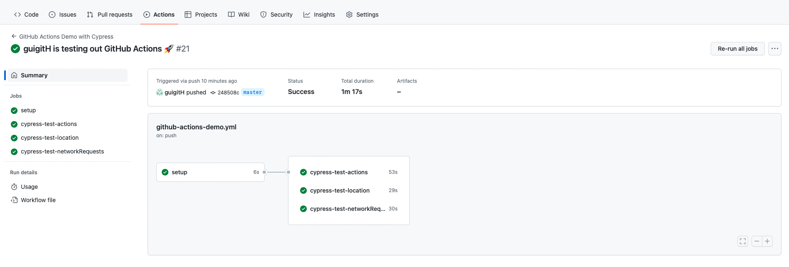

# cypress-github-action-demo

This repository provides simple test files with good practices on how to use cypress. You will find basic usage of github actions with 3 concurrents parallel tests.

# Installation

1. Clone this repository:
git clone https://github.com/guigitH/cypress-github-action-demo.git

2. Go to the project's root directory

3. Install the dependencies:
`npm install`

# Usage
Use the `npm run cy:run` script to run all tests in Chrome.

# Github-action

1. You only need a github account.

2. Push to your remote repository on github, github action will be automatically running. 

## Configuration

1. Setup: we currently use `ubuntu-latest` machine and `node 16.x`.
2. Config: The configuration can be found in `.github/workflows/github-actions-demo.yml`. 
3. Cypress: 3 concurrent runs, split by file name.

